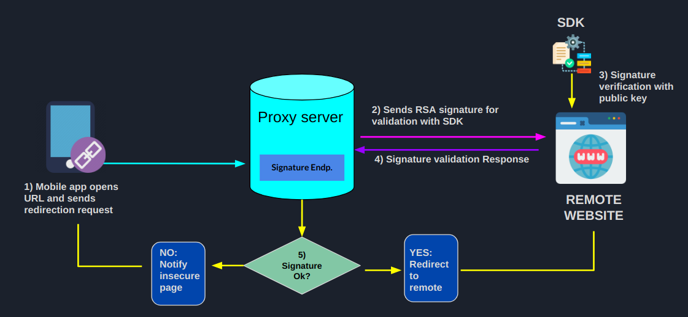

# Veralink Smartshield SDK
SDK tool for integrating Veralink Smartshield safe URL redirects. This tool is meant to be installed in the organization's webserver and to listen to incoming verification requests from the authorized [Proxy Server](https://github.com/luisrowley/veralink-smartshield).



## Pre-requisites
If not done already, you would need to:
- Install [Node.js](https://nodejs.org/en/) @latest version
- Install [PM2 process manager](https://www.npmjs.com/package/pm2) 
## Getting started
- Clone the repository
```
git clone https://github.com/luisrowley/veralink-smartshield-sdk
```
- Install dependencies
```
cd veralink-smartshield-sdk
npm install
```
- Building and testing locally
```
pm2 start ecosystem.config.js --env development
```

## URL verify process
- Once started in development, this SDK starts a server at **`http://localhost:3001`** and it waits for incoming connections at the **/verify** endpoint that comes from the [Proxy Server](https://github.com/luisrowley/veralink-smartshield).

- For testing locally using the [Proxy Server](https://github.com/luisrowley/veralink-smartshield), the URL would be:
**`http://localhost:3000/?url=http://localhost:3001`**, where **localhost:3000** would be the *Proxy Server* and **localhost:3001** the local SDK server.

- Finally, you would need to compile and run the [Mobile app verifier](https://github.com/luisrowley/veralink-smartshield-app) and scan the QR code you will see on screen.

## Caveats
- In order to check the integrity of the incomming connection, the SDK validates an RSA cryptographic signature using a local **public key** derived from the **private key** that sits at the [Proxy Server](https://github.com/luisrowley/veralink-smartshield). The transaction of such public key occurs only at initialization using a previously authorised bearer token.

## SDK Docs
- TBD